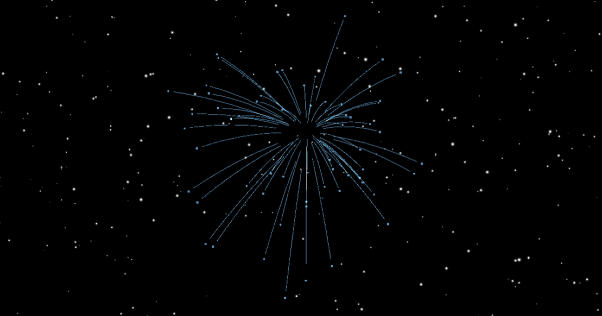

# 2026 - New Year Fireworks Celebration 🎆

An interactive, real-time fireworks experience to celebrate the arrival of 2026. Launch fireworks by clicking anywhere on the screen and watch them sync with users around the world!



## ✨ Features

- **Real-time Multiplayer**: See fireworks launched by users worldwide through Pusher WebSockets
- **Distance-based Scaling**: Fireworks from nearby users appear larger, while distant ones appear smaller
- **Interactive 3D Graphics**: Built with Three.js for stunning visual effects
- **Countdown Timer**: Live countdown to midnight on New Year's Eve
- **Volume Control**: Adjustable sound effects with auto-fade UI
- **Location-aware**: Uses geolocation to calculate firework scaling (privacy-focused, no data stored)
- **Performance Optimized**: Rate limiting, garbage collection, and efficient rendering
- **Responsive Design**: Works beautifully on desktop and mobile devices

## 🚀 Live Demo

Visit [2026.harryruiz.com](https://2026.harryruiz.com) to experience it live!

## 🛠️ Tech Stack

- **Framework**: [Next.js 15](https://nextjs.org/) (App Router)
- **Language**: TypeScript
- **3D Graphics**: [Three.js](https://threejs.org/)
- **Real-time**: [Pusher](https://pusher.com/)
- **Styling**: Tailwind CSS
- **Fonts**: Next.js Font Optimization (Geist, Dancing Script)
- **Analytics**: Vercel Analytics & Speed Insights
- **Deployment**: Vercel

## 🎮 How It Works

### Firework System

1. **Click anywhere** on the screen to launch a firework
2. A rocket trails upward with realistic physics
3. At the peak, it explodes into colorful particles with trails
4. Your firework is broadcast to all connected users via Pusher

### Distance Scaling

Fireworks are scaled based on geographic distance:
- **0-50 km**: Full size and brightness
- **50-200 km**: Slightly smaller (0.8x scale)
- **200-1000 km**: Medium distance (0.65x scale)
- **1000-3000 km**: Small (0.45x scale)
- **3000-8000 km**: Very small (0.35x scale)
- **8000+ km**: Tiny and pale (0.175x scale)

### Special Effects

- **Twinkling Stars**: Background stars with shader-based animation
- **New Year Celebration**: Automatic firework show at midnight
- **Huge Centerpiece Firework**: Special multi-layered firework for New Year
- **Writing Animation**: Cursive "Happy New Year" text with SVG path animation

## 🏗️ Project Structure

```
happy-new-year/
├── app/
│   ├── api/
│   │   ├── firework/
│   │   │   └── route.ts          # Firework broadcast API
│   │   └── happy-new-year/
│   │       └── route.ts          # New Year trigger API
│   ├── layout.tsx                # Root layout with metadata
│   ├── page.tsx                  # Home page
│   └── globals.css               # Global styles
├── components/
│   ├── Countdown.tsx             # Countdown timer
│   ├── Fireworks3D.tsx           # Main 3D fireworks engine
│   ├── NightSky.tsx              # Main container component
│   ├── Terms.tsx                 # Privacy/location info modal
│   └── VolumeControl.tsx         # Audio control component
├── public/
│   ├── sounds/
│   │   ├── explosion.mp3         # Explosion sound effect
│   │   └── rocket-launch.mp3     # Launch sound effect
│   └── og-image.png              # Open Graph image
└── README.md
```

## 👨‍💻 Author

**Harry Ruiz**
- Website: [harryruiz.com](https://harryruiz.com)
- Project: [2026.harryruiz.com](https://2026.harryruiz.com)

## 🙏 Acknowledgments

- Three.js community for amazing 3D graphics library
- Pusher for real-time WebSocket infrastructure
- Vercel for seamless deployment
- Next.js team for the excellent framework

## 🎉 Happy New Year 2026!

Feel free to contribute, report issues, or suggest improvements!